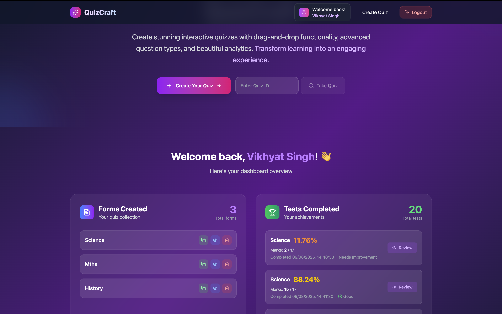
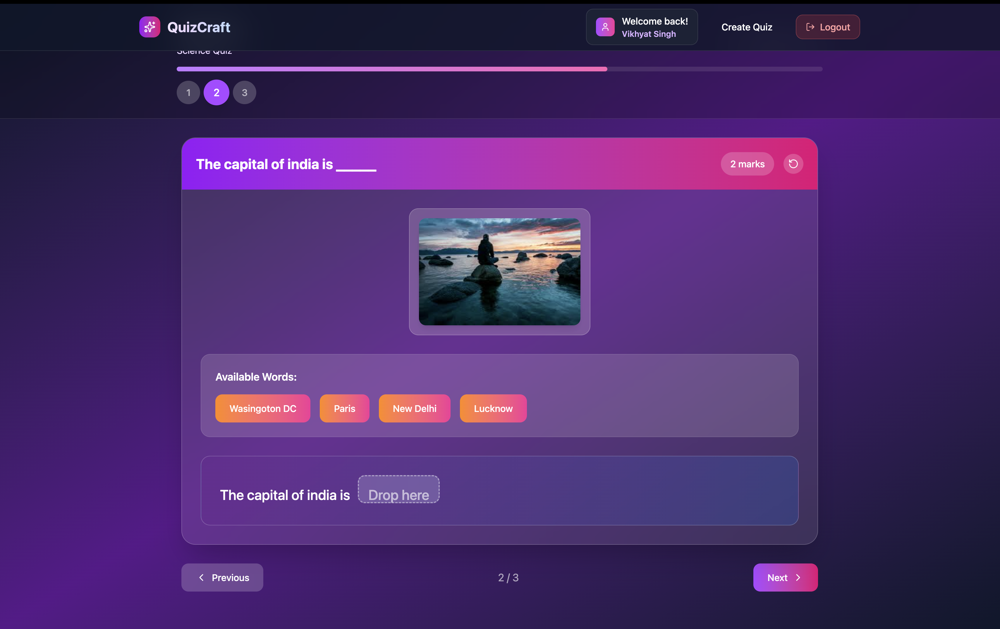
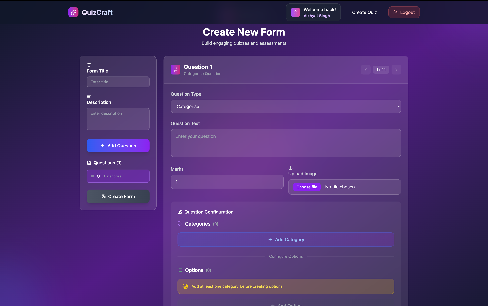

# 📝 Quiz App

A full-stack quiz platform where users can **register**, **log in**, **create quizzes**, **take quizzes**, and view their **quiz history**. Each quiz stores submissions and user scores for easy tracking.

---

## 🚀 Live Demo

* **Frontend + Backend** (Render): [[https://quizcraft-gycu.onrender.com](https://quizcraft-gycu.onrender.com/)]
  ⚠️ Please wait 2–3 minutes for the Render server to wake up.

---

## 📦 Tech Stack

* **Frontend**: React (Vite) + TailwindCSS + Zustand (state management)
* **Backend**: Node.js + Express
* **Database**: MongoDB (via Mongoose)
* **Auth**: JWT
* **Hosting**: Render (Frontend + Backend)

---

## 🛠️ Installation & Running Locally

### 1. Clone the repository

```bash
git clone https://github.com/your-username/QuizCraft.git
cd QuizCraft
```

### 2. Install Backend

```bash
cd backend
npm install
npm run dev
```

Backend will run on `http://localhost:5001`

Create a `.env` file in `backend/` and add:

```
PORT=5001
MONGO_URI=your_mongodb_connection_string
JWT_SECRET=your_jwt_secret
```

### 3. Install Frontend

Open a new terminal:

```bash
cd frontend
npm install
```

Then start the dev server:

```bash
npm run dev
```

Frontend will be available at `http://localhost:5173`

---

## ✨ Features

* 🔐 JWT-based authentication
* 📝 Create quizzes with multiple questions & options
* 🧾 View history of quizzes **created** and **taken**
* 🖱 Select answers and submit quizzes
* 📊 View scores and submission history
* 🚫 Prevents retaking the same quiz
* 🎯 Tracks total submissions for each quiz

---

## 📸 Screenshots

| Home Page                       | Take Quiz                                 | Create Quiz                                   |
| ------------------------------- | ----------------------------------------- | --------------------------------------------- |
|  |  |  |

---

## 🌟 Extra Features

The following features were implemented **in addition** to basic requirements:

* **Retake Prevention**: Users cannot take the same quiz twice
* **Form Submission Count**: Tracks number of submissions for each quiz
* **Test Given & Created History**: Separate views for quizzes taken and created
* **Responsive Design**: Works across desktop and mobile
* **Protected Routes**: Quizzes and creation pages require login
* **Zustand State Management**: Simplifies global state handling

---

## 📐 Folder Structure

```
quiz-app/
│
├── backend/
│   ├── controllers/
│   │   ├── auth.controller.js
│   │   ├── form.controller.js
│   │   └── test.controller.js
│   ├── middleware/
│   │   └── auth.middleware.js
│   ├── models/
│   │   ├── User.js
│   │   └── Form.js
│   ├── routes/
│   │   ├── auth.routes.js
│   │   ├── form.routes.js
│   │   └── test.routes.js
│   ├── utils/
│   │   └── db.js
│   └── server.js
│
├── frontend/
│   ├── src/
│   │   ├── components/
│   │   │   ├── Navbar.jsx
│   │   │   ├── Footer.jsx
│   │   ├── lib/
│   │   │   ├── axios.js
│   │   ├── pages/
│   │   │   ├── Home.jsx
│   │   │   ├── Login.jsx
│   │   │   ├── Register.jsx
│   │   │   ├── CreateForm.jsx
│   │   │   ├── TakeTest.jsx
│   │   │   └── History.jsx
│   │   ├── store/
│   │   │   ├── authStore.js
│   │   │   └── testStore.js
│   │   ├── App.jsx
│   │   └── main.jsx
│   └── index.html
│
├── .env
├── .gitignore
├── README.md
└── package.json
```

---

## 📬 Feedback & Contributions

Feel free to open issues or submit pull requests. Feedback, suggestions, and improvements are welcome!

---

## 🔗 Useful Links

* [MongoDB](https://www.mongodb.com/)
* [Render](https://render.com/)
* [Netlify](https://netlify.com/)

---

If you want, I can also **add example `.env` files for both frontend & backend** so your GitHub repo works instantly for anyone cloning it. Would you like me to prepare that too?
